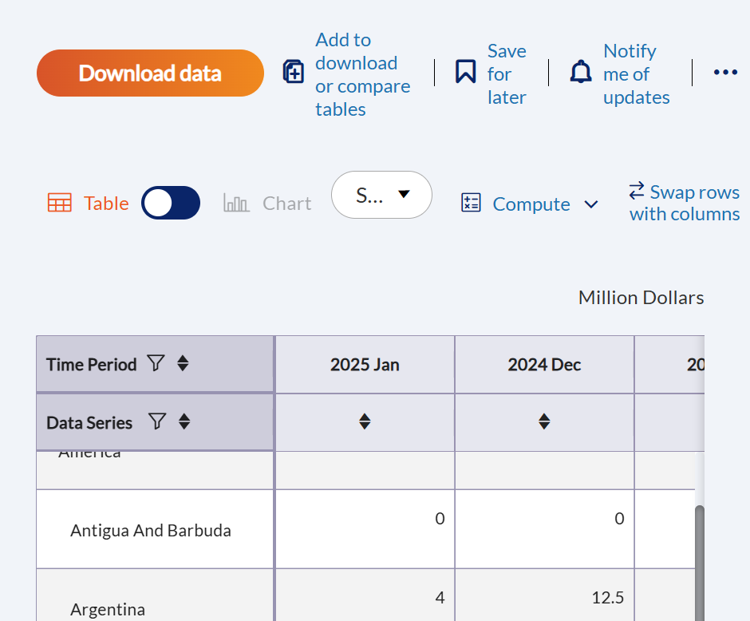
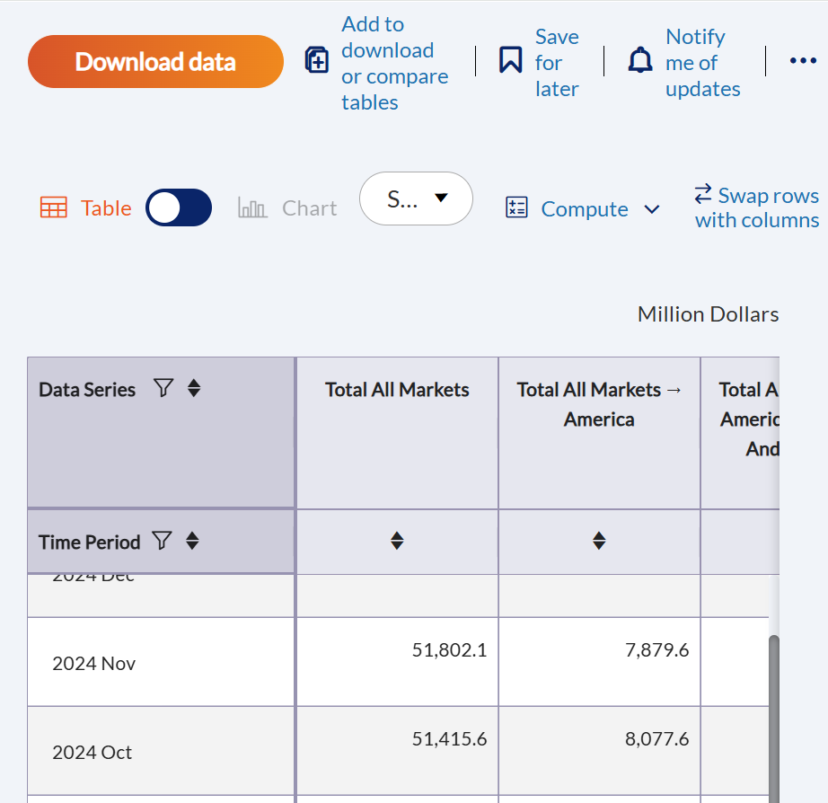
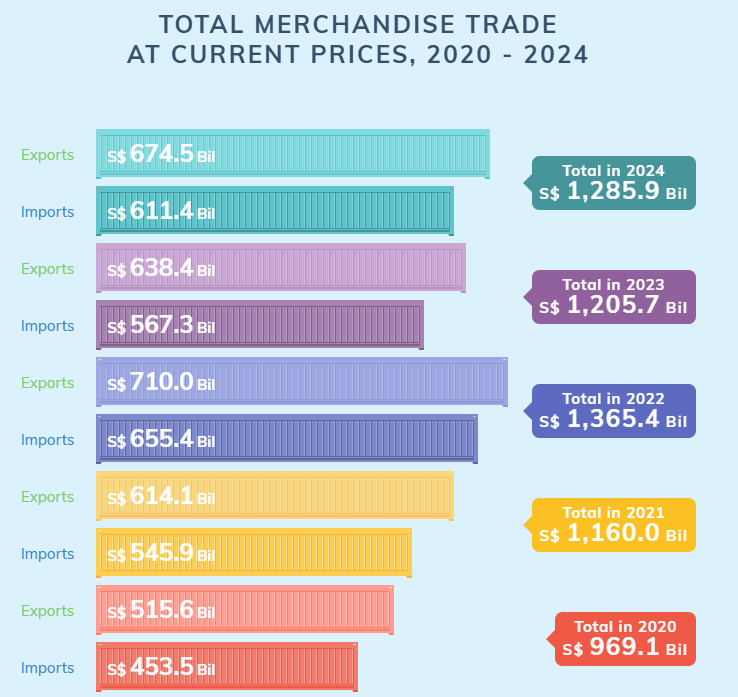
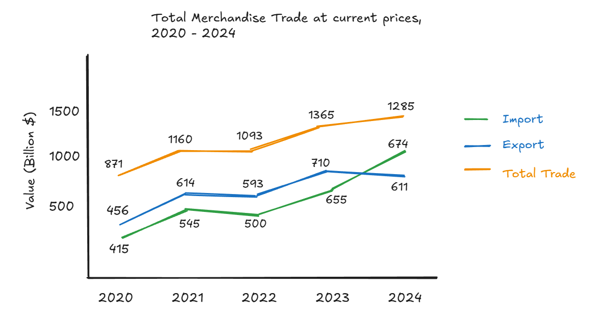
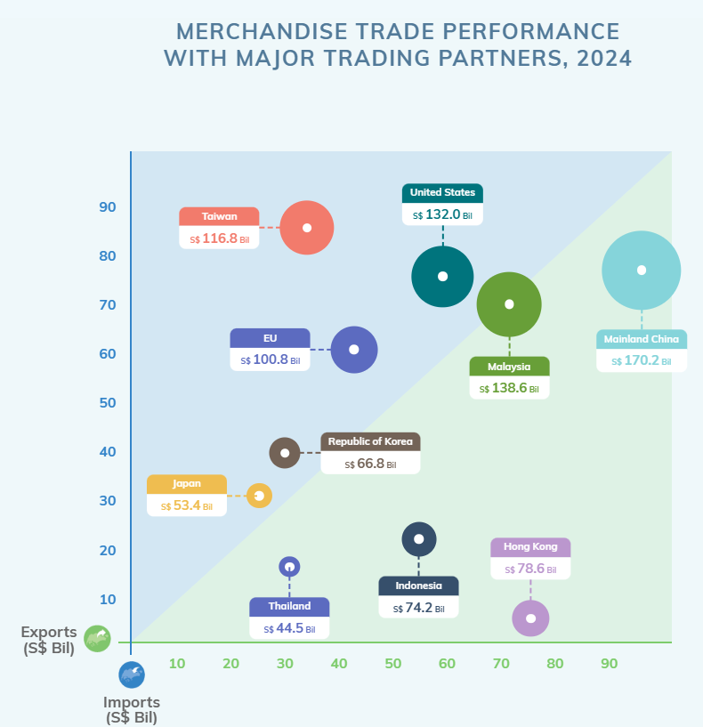
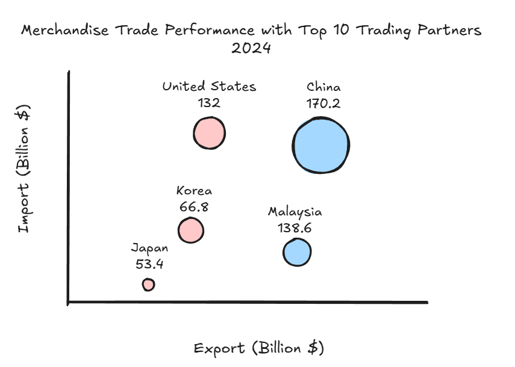
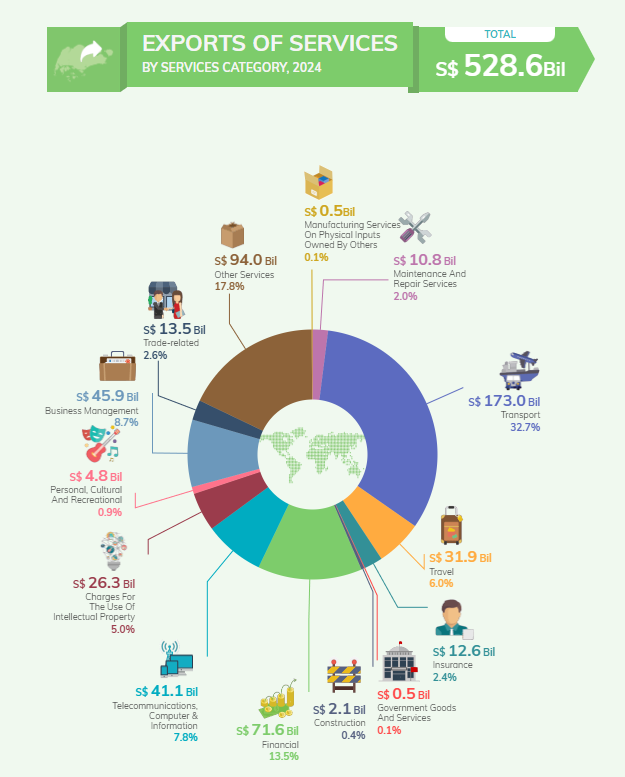
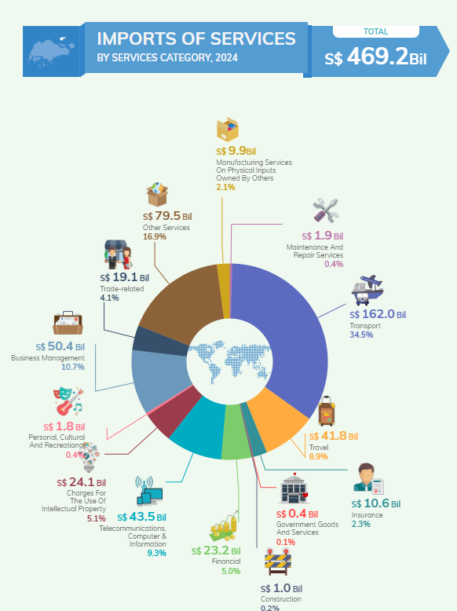
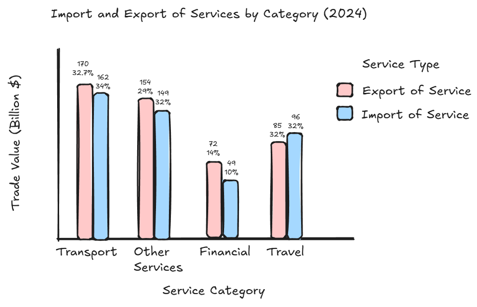

# Overview

## Setting the scene

Since Donald Trump took office as President of the United States on January 20, 2025, global trade has been a closely watched topic.

In this take-home exercise, I will apply various visual analytics techniques, with a focus on time series data, to explore and analyze the evolving trends and patterns of Singapore’s international trade over the 10-year period from 2015 to 2024.

## Objectives

This exercise focuses on two key objectives:

1.  Redesigning Three Visualizations from [Singstat](https://www.singstat.gov.sg/modules/infographics/singapore-international-trade)

    -   Evaluate the strengths and weaknesses of the existing visualizations and propose improved designs through sketches.

    -   Use ggplot2 and other relevant R packages to implement the redesigned visualizations.

2.  Time-Series Analysis of Merchandise Trade by Region/Market

    -   Analyze merchandise trade by Region/Market using time-series analysis techniques.

    -   Relevant data visualization methods and R packages will be applied to uncover trends and patterns through charts and graphs.

## The Data

The below datasets were downloaded from Singstat:

-   [Merchandise Trade by Region/Market](https://www.singstat.gov.sg/find-data/search-by-theme/trade-and-investment/merchandise-trade/latest-data): Import, Export and Re-export values by country/market/region by month and year from January 2023 to January 2025. The relevant trade value are saved in 3 files: `merchandise_trade_exports.csv`, `merchandise_trade_imports.csv`, `merchandise_trade_re-exports.csv`

-   [Trade in Services](https://www.singstat.gov.sg/find-data/search-by-theme/trade-and-investment/trade-in-services/latest-data): Yearly Import and Export value by service category. The downloaded data is saved in `trade_in_services_total.csv`

All data were downloaded using the Table Builder of Singstat to obtain a more structured column name for Region/Market. The below demonstrate how data was downloaded for Merchandise Trade By Region/Market (Imports). The same was carried out for the rest of the datasets.

-   First we go to the Table Builder for [Imports by Region/Market](https://tablebuilder.singstat.gov.sg/table/TS/M451491)

-   Scroll down to the table display and select Swap rows with columns

    

-   The table after swapping has Region/Market as the table column with "-\>" consistently used as the delimiter to separate different levels of region/market (Total All Markets -\> America -\> Brazil). Next we click on Download data to download the table in this format and save as `merchandise_trade_imports.csv` .

    

# Set up R Environment

The below code chunk use p_load() to install and load the relevant packages into R environment

```{r}
pacman::p_load(tidyverse, CGPfunctions, ggthemes)
```

For the purpose of this exercise, 3 packages will be used:

-   **tidyverse**: A collection of R packages designed for data manipulation, visualization (**ggplot**), and analysis using a consistent and efficient workflow.

-   **CGPfunctions**: Provides helper functions for exploratory data analysis and visualization, including easy-to-use slopegraphs and other comparative charts.

-   **ggthemes**: Extends ggplot2 by offering additional themes, color scales, and formatting options to enhance the visual appeal of plots.

# Data Wrangling

## Merchandise Trade by Region/Market

The below code chunk uses `read_csv()` to load in `merchandise_trade_imports.csv` . Next pivot_longer() is used to pivot all the Region/Market columns into 1 single Market column, and `separate()` is used to split the values in Market column into the respective levels: Market, Region and Country. The final table is saved in `trade_import` tibble dataframe.

```{r}
trade_import = read_csv("data/merchandise_trade_imports.csv") |>
    pivot_longer(cols = c(2:161),
               names_to = 'Market',
               values_to = "Import_value") |>
  mutate(Market = str_remove(Market, " \\(Million Dollars\\)")) |>
  separate(Market, into = c("Market", "Region", "Country"), sep = " -> ")
```

Similar transformation is carried out for `merchandise_trade_exports.csv`. The final table is saved in `trade_export`.

```{r}
trade_export = read_csv("data/merchandise_trade_exports.csv") |>
    pivot_longer(cols = c(2:161),
               names_to = 'Market',
               values_to = "Export_value") |>
  mutate(Market = str_remove(Market, " \\(Million Dollars\\)")) |>
  separate(Market, into = c("Market", "Region", "Country"), sep = " -> ")
```

Similar transformation is carried out for `merchandise_trade_re-exports.csv`. The final table is saved in `trade_re_export` as in below code chunk.

```{r}
trade_re_export = read_csv("data/merchandise_trade_re-exports.csv") |>
    pivot_longer(cols = c(2:161),
               names_to = 'Market',
               values_to = "Re_Export_value") |>
  mutate(Market = str_remove(Market, " \\(Million Dollars\\)")) |>
  separate(Market, into = c("Market", "Region", "Country"), sep = " -> ")
```

Lastly, full_join() is used to join the 3 tibble dataframe: `trade_import`, `trade_export` and `trade_re_export` together. Next, `mutate()` is used to create 4 new columns on: total export value, total trade value, month and year.

```{r}
trade_all = full_join(trade_import, trade_export, by = c("Data Series","Market","Region","Country"))
# Bring in re-export values
trade_all = trade_all |>
  full_join(trade_re_export,by = c("Data Series","Market","Region","Country"))|>
  filter(!is.na(Country)) |>
    mutate(Total_Export_value = Export_value + Re_Export_value,
           Total_Trade_value = Import_value + Total_Export_value,
          Year = as.numeric(substr(`Data Series`, 1, 4)),
          Month = str_sub(`Data Series`, -3, -1)) |>
          filter(Year >= 2015 & Year <= 2024) |>
  select(-c("Data Series"))
```

## Trade in Services

The below code chunk uses `read_csv()` to load in `trade_in_services.csv`. Next `pivot_longer()` is used to pivot all the Service categories columns into 1 single Services column, and `separate()` is used to split the values in Services column into 4 levels of service categories. The final table is saved in `trade_in_services` tibble dataframe.

For the purpose of visualization make-over from Singstat, only the level 3 service category is retained to reflect the same level as in the original visualization. To obtain this, `filter()` is used to filter for records where `Level_4` is null and `Level_3` is not null.

```{r}
trade_in_services = read_csv("data/trade_in_services.csv") |>
  pivot_longer(cols = c(2:52),
               names_to = 'Services',
               values_to = "Trade_value") |>
  mutate(Market = str_remove(Services, " \\(Million Dollars\\)")) |>
  separate(Market, into = c("Level_1", "Level_2", "Level_3", "Level_4"), sep = " -> ") |>
  filter(is.na(Level_4)) |>
  filter(!is.na(Level_3)) |>
  select(-c("Services","Level_4"))
```

# Data Visualization Make-over

## Total Merchandise Trade from 2020 - 2024

### Critique

Below is a screenshot of the original visualization as shown on [SingStat](https://www.singstat.gov.sg/modules/infographics/singapore-international-trade).



Although the aesthetics and color scheme of the visualization are visually appealing, and the data labels are clear, several improvements can enhance clarity and interpretability:

-   Bar Orientation: Since the chart presents yearly import, export, and total trade values, using horizontal bars makes it difficult to discern trends over the five-year period (2020–2024). A vertical orientation, where time is represented on the horizontal axis and trade values on the vertical axis, would make it more intuitive for viewers to identify patterns and trends.

-   Clustered Bars: Placing import and export values side by side in a clustered bar format makes it challenging to compare these values across years. Additionally, total trade values displayed in text boxes do not provide a clear visual representation of trends. A line chart, with separate lines for import, export, and total trade values, would allow for better year-over-year comparisons and a clearer analysis of individual and combined trends.

-   Color Scheme: The current visualization uses different colors for each year, with exports in a lighter shade. This approach can be distracting when comparing import or export values across years. A more effective approach would be to assign distinct colors to each variable (import, export, and total trade), ensuring consistency across years. This would make it easier for viewers to distinguish trends within each trade category and compare them more effectively.

### Make-over Sketch



### Enhanced Visualization

The above line chart were plotted using **ggplot** functions as follows.

```{r}
#| code-fold: true
#| code-summary: "Show the code"
# Summarize total import and export by year
trade_summary <- trade_all %>%
  group_by(Year) %>%
  summarise(
    Total_Import = sum(Import_value, na.rm = TRUE)/1000,
    Total_Export = sum(Total_Export_value, na.rm = TRUE)/1000,
    Total_Trade = sum(Total_Trade_value, na.rm = TRUE)/1000) |>
  pivot_longer(cols = c(Total_Import, Total_Export, Total_Trade), 
               names_to = "Trade_Type", values_to = "Value") |>
  filter(Year %in% c(2020, 2021, 2022, 2023, 2024))

# Find maximum value to set y-axis limits
max_value <- max(trade_summary$Value, na.rm = TRUE)

# Create line plot with data labels and y-axis starting from 0
ggplot(trade_summary, aes(x = Year, y = Value, color = Trade_Type, group = Trade_Type)) +
  geom_line(size = 1) +
  geom_point(size = 2) +
  geom_text(aes(label = round(Value, 1)), vjust = -0.5, size = 4) +
  scale_y_continuous(limits = c(0, max_value * 1.1)) +
  labs(
    title = "Total Merchandise Trade at current prices, 2020 - 2024",
    x = "Year",
    y = "Value (Billion S$)",
    color = "Trade Type"
  ) +
  theme_solarized() +
  theme(plot.title = element_text(hjust = 0.5,face = "bold", size = 20, color = 'black'),
        legend.title = element_text(hjust = 0.9,size = 14, face = "bold",color = 'black'),
        legend.text = element_text(size = 14,color = 'black'),
        axis.title.x=element_text(size=12,face="bold",color = 'black'),
        axis.title.y=element_text(size=12,face="bold",color = 'black'))
```

This redesigned line chart conveys the same information as the original visualization but enhances readability by enabling easier comparison of import, export, and total trade trends over the five-year period from 2020 to 2024.

## Merchandise Trade Performance with Major Partners in 2024

### Critique

Below is a screenshot of the original visualization as shown on [SingStat](https://www.singstat.gov.sg/modules/infographics/singapore-international-trade).



-   Inconsistent Level of Granularity

    -   The inclusion of the EU as a single bubble, while all other bubbles represent individual countries, creates inconsistency in the data representation.

    -   To ensure accurate interpretation and avoid confusion, all bubbles should consistently represent data at the country level rather than mixing regional and country-level entities.

-   Coloring Issues

    -   Unnecessary Variation: Each bubble already represents a distinct country, making excessive color differentiation unnecessary. Using too many colors can be distracting to chart viewers.

    -   A more effective approach is to color the bubbles based on trade balance categories rather than assigning arbitrary colors to each country.

-   Background Color and Readability

    -   Current Background Coloring: The background is shaded in green (trade surplus) and blue (trade deficit), which is useful in a scatter plot where points are small and clearly positioned. Since bubbles have varying sizes, it becomes hard to determine whether a bubble falls within the green or blue zone, especially when its center is near the diagonal line.

    -   Instead of relying on the background color, we should directly color the bubbles into two categories—one for trade surplus partners and another for trade deficit partners. This ensures readers can immediately distinguish Singapore’s trade deficit vs. trade surplus partners without confusion.

### Make-over Sketch



### Enhanced Visualization

The below code chunk plots the sketched bubble chart using **ggplot** functions.

```{r}
#| code-fold: true
#| code-summary: "Show the code"
# Summarize total trade for full year 2024
trade_summary_2024 <- trade_all %>%
  filter(Year == 2024) %>%  # Filter for Year 2024
  group_by(Country) %>%
  summarise(
    Total_Export_value = sum(Total_Export_value, na.rm = TRUE)/1000,
    Import_value = sum(Import_value, na.rm = TRUE)/1000,
    Total_Trade_value = sum(Total_Trade_value, na.rm = TRUE)/1000) %>%
  arrange(desc(Total_Trade_value)) %>%  # Sort by Total Trade
  slice_head(n = 10) %>%  # Select top 10 countries
  mutate(Trade_Balance = ifelse(Import_value > Total_Export_value, "brown", "blue"))  # Assign colors

# Create scatter plot
ggplot(trade_summary_2024, aes(x = Total_Export_value, y = Import_value, size = Total_Trade_value, color = Trade_Balance, label = paste(Country, "\n", round(Total_Trade_value, 1)))) +
  geom_point(alpha = 0.6, show.legend = FALSE) +
  geom_text(vjust = -1, size = 4) + 
  scale_color_identity() +
  scale_y_continuous(expand = expansion(mult = c(0, 0.2))) +
  expand_limits(x = 0, y = 0) +
  labs(
    title = "Merchandise Trade Performance with Top 10 Trading Partners (2024)",
    x = "Export (Billion S$)",
    y = "Import (Billion S$)",
    size = "Total Trade (Billion S$)"
  ) +
  theme_solarized() +
    theme(plot.title = element_text(hjust = 0.5,face = "bold", size = 20, color = 'black'),
        axis.title.x=element_text(size=12,face="bold",color = 'black'),
        axis.title.y=element_text(size=12,face="bold",color = 'black'))
```

The improved bubble chart conveys the same information on Import, Export, and Total Trade values for the top 10 countries with the highest merchandise trade in 2024 as the original visual. The trade surplus partners are colored in **blue** and trade deficit countries are colored in **brown**. By adjusting the color-coding logic, it provides an immediate and intuitive distinction between countries where Singapore exports more than it imports and vice versa, enhancing the clarity of trade balance insights.

## Import & Export by Services Category in 2024

### Critique

Below is a screenshot of the original visualization as shown on [SingStat](https://www.singstat.gov.sg/modules/infographics/singapore-international-trade).





-   Chart Type: While donut charts can be visually appealing, they become less effective when displaying data with too many categories. In such cases, it becomes difficult to compare the contributions of individual categories.

-   Icon Usage: Although incorporating different icons for each category enhances aesthetics, it can clutter the visualization, making it harder for viewers to extract the key information—the contribution of each category to service imports or exports.

-   Coloring: Using distinct colors for each category, especially when there are more than 10 categories, can overwhelm the viewer and lead to confusion.

-   Improvement: To address these issues and provide a clearer comparison of contributions among service categories for both imports and exports, switching to a clustered column chart can offer a better alternative. This clustered columns will use only two colors to differentiate between service imports and exports, simplifying the comparison and improving readability.

### Sketch Make-over

Below is the sketch of the make-over graph.



### Enhanced Visualization

The below code chunk plots the clustered column chart of the below sketch using **ggplot** functions.

First we filter for 2024 data and create a new dataframe to calculated the contribution of each service category to the total import or export values using the below code chunk.

```{r}
# Filter data for the year 2024 and select relevant columns
trade_services_2024 <- trade_in_services %>%
  filter(`Data Series` == 2024) %>%
  filter(Level_2 %in% c("Imports Of Services", "Exports Of Services")) %>%
  select(Level_3, Level_2, Trade_value) |>
  mutate(Trade_value = Trade_value/1000)

# Compute total trade value (Import + Export) for each service category
total_trade_by_service <- trade_services_2024 %>%
  group_by(Level_3) %>%
  summarise(Total_Trade = sum(Trade_value, na.rm = TRUE)) %>%
  arrange(desc(Total_Trade))  # Sort in descending order

# Merge total trade back into the dataset
trade_services_2024 <- trade_services_2024 %>%
  left_join(total_trade_by_service, by = "Level_3")

# Calculate percentage contribution for each Level_3 category
total_trade_by_type <- trade_services_2024 %>%
  group_by(Level_2) %>%
  summarise(Total_Trade_Type = sum(Trade_value, na.rm = TRUE))

trade_services_2024 <- trade_services_2024 %>%
  left_join(total_trade_by_type, by = "Level_2") %>%
  mutate(Percentage = (Trade_value / Total_Trade_Type) * 100)

# Convert Level_3 into a factor sorted by total trade value
trade_services_2024$Level_3 <- factor(trade_services_2024$Level_3, 
                                      levels = total_trade_by_service$Level_3)
```

The below code chunk used ggplot functions to plot the proposed clustered column chart.

```{r}
#| code-fold: true
#| code-summary: "Show the code"
#| fig-height: 12
#| fig-width: 10
# Calculate max trade value to expand y-axis limit
max_value <- max(trade_services_2024$Trade_value, na.rm = TRUE)
# Plot clustered column chart with data labels and sorted order
ggplot(trade_services_2024, aes(x = Level_3, y = Trade_value, fill = Level_2)) +
  geom_col(position = "dodge") +  # Clustered columns
  geom_text(aes(label = paste0(round(Trade_value, 1), "\n", round(Percentage, 0), "%")),
            position = position_dodge(width = 0.9), vjust = -0.5, size = 4) +
  labs(
    title = "Import and Export of Services by Category (2024)",
    x = "Service Category",
    y = "Trade Value (Billion S$)",
    fill = "Service Type"
  ) +
  expand_limits(y = max_value * 1.1) +
  theme_solarized() +
  theme(axis.text.x = element_text(angle = 45, hjust = 1),
        plot.title = element_text(hjust = 0.5,face = "bold", size = 20, color = 'black'),
        legend.title = element_text(hjust = 0.9,size = 12, face = "bold",color = 'black'),
        legend.text = element_text(size = 12,color = 'black'),
        axis.title.x=element_text(size=12,face="bold",color = 'black'),
        axis.title.y=element_text(size=12,face="bold",color = 'black'))
```

The updated chart provides viewers with the same information on total trade value and the contribution of each category to total service imports or exports, while also enabling an additional comparison between the export and import values of each service. This was not easily achievable with the original two donut charts, as the import and export values were displayed in separate visuals.

# Time series

## Total Trade Value Trend and Seasonality

To identify any peak periods in trading activities in Singapore throughout the year, a cycle plot will be used to analyze the trading patterns for each month across the 10 years of trading data, from 2015 to 2024.

The below code chunk use `factor()` to ensure the month names are plotted in correct order.

```{r}
trade_all$Month <- factor(trade_all$Month, 
                          levels = c("Jan", "Feb", "Mar", "Apr", "May", "Jun", 
                                     "Jul", "Aug", "Sep", "Oct", "Nov", "Dec"), 
                          ordered = TRUE)
```

Next we compute the total trade value by year and month using `group_by()` and `summarise()` as in the below code chunk.

```{r}
trade_total = trade_all |>
  group_by(Year, Month) |>
  summarise(total_trade_value = sum(Total_Trade_value)/1000) |>
  ungroup()
```

The below code chunk computes the average trade value of each month across 10 years from 2015 to 2024. This value will be used to plot the average line in the cycle plot later on.

```{r}
hline.data <- trade_total %>% 
  group_by(Month) %>%
  summarise(avg_trade_value = mean(total_trade_value))
```

Next we plot the cycle plot using **ggplot** functions as in the below code chunk.

```{r}
#| fig-width: 12
ggplot() + 
  geom_line(data=trade_total,
            aes(x= Year, 
                y= total_trade_value, 
                group= Month), 
            colour="black") +
  geom_hline(aes(yintercept=avg_trade_value), 
             data=hline.data, 
             linetype=6, 
             colour="red", 
             size=0.5) + 
  facet_grid(~Month) +
  labs(axis.text.x = element_blank(),
       title = "Total Trade by Month, Jan 2015-Dec 2024") +
  xlab("") +
  ylab("Total Trade Value (Billion S$)") +
  theme_solarized() +
  theme(axis.text.x = element_text(angle = 45, hjust = 1),
        plot.title = element_text(hjust = 0.5,face = "bold", size = 20, color = 'black'),
        axis.title.x=element_text(size=12,face="bold",color = 'black'),
        axis.title.y=element_text(size=12,face="bold",color = 'black'))
```

Key observations from the above graph:

-   The plot reveals no clear seasonality in monthly trading activities. However, peak periods are observed between July and October, while January and February register the lowest trade values, likely due to reduced economic activity during festive periods such as Lunar New Year.

-   The black lines, representing yearly trade for each month, indicate an upward trend across all months, reflecting overall growth in trade activity over the years. Additionally, the widening gap between peak and low months suggests increasing fluctuations in monthly trade.

-   The most recent data (2022–2024) shows consistently higher trade values compared to earlier years, though the trend begins to level off after 2022. This may be attributed to strong economic recovery post-COVID in 2022, followed by a slowdown leading into 2024.

## Trade with Major Trading Partners

### Total Trade Value

After analyzing the monthly trade value trends across all countries, this section focuses on Singapore’s top 10 trading partners to examine trade growth and trends with these key partners.

The below code chunk generate the top 10 countries list with highest total trade value in 2024.

```{r}
top_10_countries <- trade_all %>%
  filter(Year == 2024) %>%  # Keep only 2024 data
  group_by(Country) %>%
  summarise(Total_Trade_value = sum(Total_Trade_value, na.rm = TRUE)) %>%
  arrange(desc(Total_Trade_value)) %>%
  slice_head(n = 10) %>%  # Select top 10 countries
  pull(Country)  # Extract country names
```

Next we filter for these 10 countries in the trade_all dataframe and calculate the trade value and trade balance by month and year of each country using `filter()`, `group_by()` and `summarise()` as in the below code chunk.

```{r}
trade_total_yearly <- trade_all %>%
  filter(Country %in% top_10_countries) |>
  group_by(Year, Country) |>
  summarise(Total_Trade_value = sum(Total_Trade_value, na.rm = TRUE)/1000,
            Total_trade_balance = round(sum(Total_Export_value)- sum(Import_value),0)/1000) |>
  ungroup()
```

The following code chunk uses `newggslopegraph()` to create a slope graph illustrating the total trade value of Singapore's top 10 trading partners at five-year intervals from 2015 to 2024.

```{r}
trade_total_yearly %>% 
  mutate(Year = factor(Year)) %>%
  filter(Year %in% c(2015, 2019, 2024)) %>%
  newggslopegraph(Times = Year,
                  Measurement = Total_Trade_value,
                  Grouping = Country,
                Title = "Total Trade Values (Billion S$) of Top 10 Countries (based on 2024 trade value)",
                SubTitle = "2015 - 2019 - 2024",
                Caption = NULL)
```

Key observations from the above graph:

-   Most countries show an upward trend in trade value from 2015 to 2024, indicating expanding trade relationships.

-   China, Malaysia, and the United States remain dominant trade partners, with China's trade value increasing significantly from 128.6 billion S\$ (2015) to 170.2 billion S\$ (2024). They are also the 3 countries with highest trade value growth among the top 10 partners, with trade value growing more than 20% every 5 years.

-   Taiwan exhibits notable growth, moving from 53.9 billion S\$ (2015) to 116.7 billion S\$ (2024), more than doubling its trade value. This suggests stronger trade integration and higher demand for Taiwanese goods/services.

-   Japan, India, and Thailand have seen moderate but consistent trade growth, indicating increasing economic cooperation with Singapore.

### Trade Balance

While total trade value provides insight into the scale of trade activities, analyzing trade balance (deficit or surplus) is crucial for understanding economic sustainability. A high trade value does not necessarily indicate a strong economy if imports consistently exceed exports, leading to a trade deficit. Conversely, a trade surplus suggests a competitive export sector and potential economic strength.

In this section, we look into trade balance of Singapore's top 10 trade partners at five-year intervals from 2015 to 2024.

```{r}
trade_total_yearly %>% 
  mutate(Year = factor(Year)) %>%
  filter(Year %in% c(2015, 2019, 2024)) %>%
  newggslopegraph(Times = Year,
                  Measurement = Total_trade_balance,
                  Grouping = Country,
                Title = "Trade Balance (Billion S$) of Top 10 Countries (based on 2024 trade value)",
                SubTitle = "2015 - 2019 - 2024",
                Caption = NULL)
```

Key observations from the above graphs:

-   Hong Kong maintains the highest trade surplus, with steady growth, indicating a strong export-driven trade relationship. Further analysis is needed to identify the industries driving exports to Hong Kong.

-   Indonesia’s trade surplus has increased significantly, particularly between 2019 and 2024.

-   China, Thailand, and India maintain moderate trade surpluses, with an upward trend over the years.However, the trade surplus with Malaysia is shrinking, suggesting that imports from Malaysia are growing faster than exports, possibly due to increased reliance on Malaysian goods and materials.

-   Noteable, trade deficit with Taiwan has surged, reaching 51.8 billion S\$ in 2024, more than triple its 14.2 billion S\$ deficit in 2015, indicating a sharp rise in imports from Taiwan. Trade deficit with the United States is also increasing, though at a moderate pace.

# Conclusion

This exercise highlights key considerations for effective data visualization:

-   Chart Type Selection: Choosing an appropriate chart type helps readers quickly grasp key insights, such as trends and comparisons.

-   Use of Colors and Icons: Overuse of colors and icons can clutter the chart and distract from key insights. Thoughtful color selection enhances clarity, highlights differences, and facilitates comparisons.

-   Clarity in Labels: Descriptive chart titles, axis labels, and data annotations provide essential context and guide readers in interpreting the data accurately.

The exercise also demonstrates the flexibility and capabilities of **ggplot2** and its extensions, together with other packages such as **CGPfunctions**, in generating a wide range of visualizations for time series dataset. These tools enable effective visual analytics with multiple customization to tailor to different datasets.
