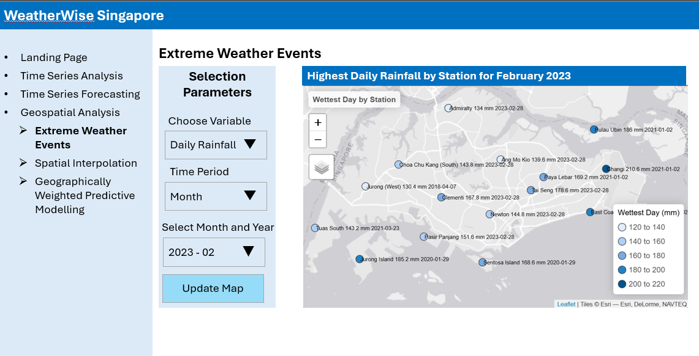
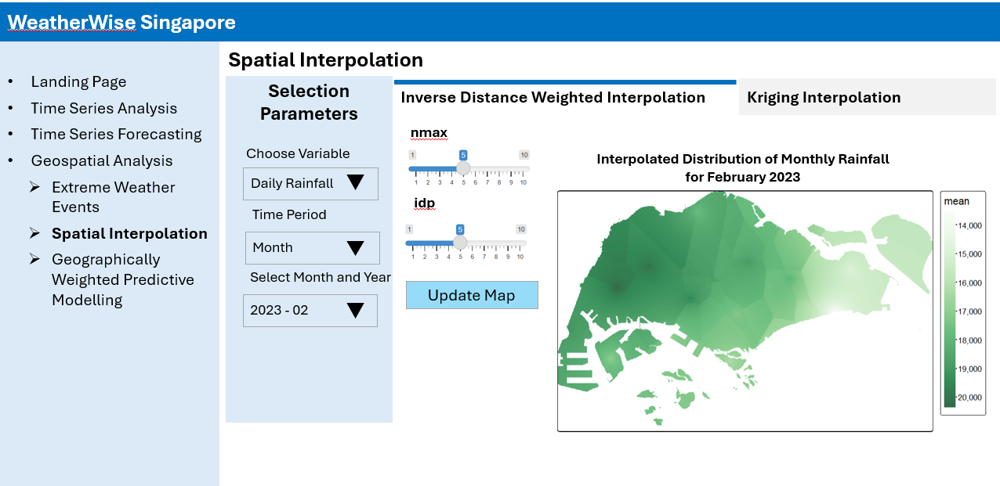
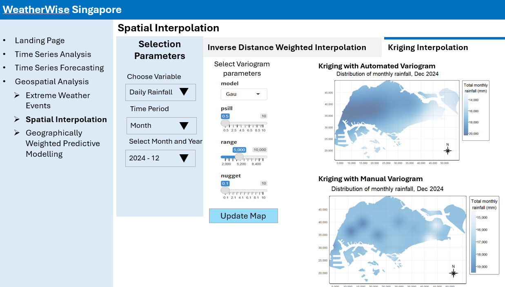
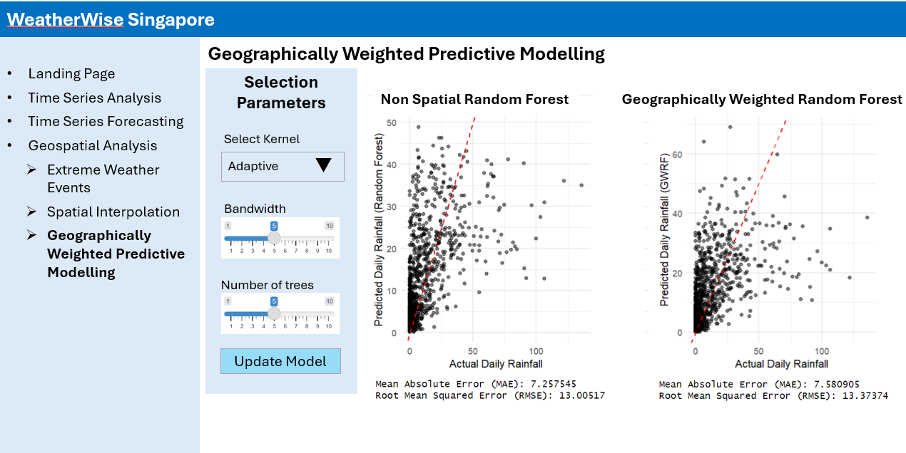

# Overview

In this take-home exercise, I will develop the **Geospatial Analysis** module prototype for our group's Shiny application, **WeatherWise Singapore – Visual Analytics to Unveil Singapore's Evolving Climate**.

My focus will be on:

-   Evaluating and ensuring that the required R packages for our Shiny application are supported on CRAN.

-   Preparing and testing specific R code to verify expected outputs.

-   Defining the parameters and outputs to be integrated into the Shiny application.

-   Selecting appropriate Shiny UI components for presenting these parameters effectively.

## The Data

For the purpose of this prototype, the below 3 datasets will be used:

-   Scraped weather data from [weather.gov.sg](https://www.weather.gov.sg/climate-historical-daily/)

-   Weather Station records from [weather.gov.sg](https://www.weather.gov.sg/wp-content/uploads/2024/08/Station_Records.pdf)

-   Singapore Master Plan 2014 Subzone Boundary from [data.gov.sg](https://data.gov.sg/datasets/d_d14da225fccf921049ab64238ff473d9/view)

# Install R packages

The below code chunk uses `p_load()` to load and install the relevant packages into R environment.

```{r}
pacman::p_load(tidyverse, tmap, sf, sfdep, corrplot, terra, gstat, automap,  SpatialML, GWmodel, Metrics, ggrepel)
```

# Data Import and Preparation

## Daily Weather Records

First we read in the daily weather records scraped from weather.gov.sg into tibble dataframe `climate_raw` using `read_csv()`.

```{r}
climate_raw = read_csv("data/Climate_Data_2015_2024.csv")
```

Next we check if the scraped data contains any duplicate.

```{r}
duplicate <- climate_raw %>% 
  group_by_all() %>% 
  filter(n()>1) %>% 
  ungroup()
  
duplicate
```

The output shows there is no duplicates.

The below code chunk uses `summary()` to have an overview of the scraped dataset.

```{r}
summary(climate_raw)
```

The output shows there are many null values, while the min max range of all weather measurements are in the normal range.

## Weather Stations

Next we read in the stations details to retrieve station types and coordinates. For our Shiny application, we focus solely on **Full AWS** stations, as they provide comprehensive data across all weather parameters. Other station types, such as Closed Stations and Daily Rainfall Stations (which only record rainfall metrics), are excluded from further analysis.

```{r}
station = read_csv('data/Station_Records.csv') |> 
  filter(Station_Type == "Full AWS Station")
```

The below code chunk checks for duplicate.

```{r}
duplicate <- station %>%    
  group_by_all() %>%    
  filter(n()>1) %>%    
  ungroup()

duplicate
```

The output shows there is no duplicate.

## Master Plan Subzone Boundary

The below code chunk imports Singapore Planning Subzone boundary to `mpsz` sf dataframe using the below functions:

-   `st_read()`: to read in shapefile

-   `st_transform()`: to ensure the coordinates are transforms to the correct CRS *3414* of Singapore Projected Coordinate System SVY21.

```{r}
mpsz = st_read(dsn = "data", layer = "MP14_SUBZONE_WEB_PL") |>
  st_transform(crs = 3414)
```

# Data Wrangling

## Join Station with Climate dataframe

First we join `station` with `climate_raw` dataframe using `inner_join()` to include only records from active Full AWS Station.

```{r}
climate = inner_join(station, climate_raw, by = "Station")
```

The below code chunk checks for duplicates in the joined dataframe.

```{r}
duplicate <- climate %>%    
  group_by_all() %>%    
  filter(n()>1) %>%    
  ungroup()    

duplicate
```

The output shows there is no duplicate in `climate` dataframe.

Next we filter climate dataset for only relevant columns for our weather analysis.

```{r}
climate <- climate |> 
  select(Station, Station_Type, Year, Month, Day,
         `Daily Rainfall Total (mm)`,
         `Mean Temperature (Celsius)`,
         `Maximum Temperature (Celsius)`,
         `Minimum Temperature (Celsius)`,
         `Mean Wind Speed (km/h)`)

climate
```

The final `climate` dataframe consists of **10 columns**, including the **5 key weather parameters** selected for further analysis.

## Missing Rainfall records

Next we check for null records from the key parameter `Daily Rainfall Total (mm)`.

```{r}
# Count missing values for each Station, Year, and Month 
missing_rain_counts <- climate %>%   
  group_by(Station, Year, Month) %>%   
  summarise(
    `Missing Daily Rainfall Total` = sum(is.na(`Daily Rainfall Total (mm)`))   ) %>%  
    # Exclude rows where all missing counts are zero
  filter(`Missing Daily Rainfall Total` > 0) |>
  ungroup()
```

```{r}
# Count the number of months per station where missing days exceed 15 
missing_rain_summary <- missing_rain_counts %>%   
  filter(`Missing Daily Rainfall Total` >= 15) %>%   
  group_by(Station, Year) %>%   
  summarise(Count_Months = n()) %>%   
  arrange(Year)|>   
  pivot_wider(names_from = Year, values_from = Count_Months) |>   
  ungroup()

missing_rain_summary
```

The output reveals 7 stations with ≥15 days of missing Daily Rainfall Total (mm) in more than one month over the years. Semakau Island station has a full year of missing data in 2019, while 2015–2017 period shows a high prevalence of missing data across stations.

## Missing Temperature Records

We carry out the same check for `Mean Temperature (Celsius)` .

```{r}
# Count missing values for each Station, Year, and Month 
missing_temp_counts <- climate %>%   
  group_by(Station, Year, Month) %>%   
  summarise(     
    `Missing Mean Temperature` = sum(is.na(`Mean Temperature (Celsius)`))) %>%   
  # Exclude rows where all missing counts are zero
  filter(`Missing Mean Temperature` > 0) |>
  ungroup()
```

```{r}
# Count the number of months per station where missing days exceed 15 
missing_temp_summary <- missing_temp_counts %>%    
  filter(`Missing Mean Temperature` >= 15) %>%   
  group_by(Station, Year) %>%   
  summarise(Count_Months = n()) %>%   
  arrange(Year)|>   
  pivot_wider(names_from = Year, values_from = Count_Months) |>   
  ungroup()

missing_temp_summary
```

The same 7 stations with significant missing `Daily Rainfall Total (mm)` are also among the 15 stations with missing `Mean Temperature (Celsius)` data, where more than 15 days are missing for certain months. Some stations have full years of missing data, with 2015–2017 particularly shows a high prevalence of missing data across stations.

## Exclude Station with many missing records

Given the extensive missing data from 2015–2017, we will retain data from 2018 onwards. For each station, we will count the total number of months with more than 15 days missing data across the years and flag stations with more than 3 missing months. Those stations will be excluded from the main `climate` dataset.

```{r}
filter_invalid_stations <- function(summary_df, from_year = 2018) {
  # Get only year columns ≥ from_year
  year_cols <- summary_df |> 
    select(where(is.numeric)) |> 
    select(matches("^[0-9]{4}$")) |> 
    select(as.character(from_year):last_col()) |> 
    colnames()

  summary_df |> 
    rowwise() |> 
    mutate(total_flagged_months = sum(c_across(all_of(year_cols)), na.rm = TRUE)) |> 
    filter(total_flagged_months >= 3) |> 
    pull(Station)
}
```

```{r}
# Get invalid stations (stations to exclude)
invalid_rain_stations <- filter_invalid_stations(missing_rain_summary)
invalid_temp_stations <- filter_invalid_stations(missing_temp_summary)
```

```{r}
# Combine all stations to exclude
stations_to_exclude <- union(invalid_rain_stations, invalid_temp_stations)
stations_to_exclude
```

The above 5 stations will be excluded. The below code chunk applies this filter on the `climate` dataframe.

```{r}
# Now filter the full dataset to only include stations from 2018-2024
climate_final <- climate |> 
  filter(!(Station %in% stations_to_exclude), Year >= 2018, Year <= 2024)

summary(climate_final)
```

Below is the list of the final 15 AWS stations in `climate_final` that we will be used for further analysis.

```{r}
climate_final %>% 
  distinct(Station) %>% 
  arrange(Station) %>% 
  mutate(Station_ID = row_number())
```

## Replacing Missing Values using SMA 5 days

The below code chunk counts the number of missing values in each column of `climate_final`.

```{r}
climate_final %>% 
  summarise(across(where(is.numeric), ~sum(is.na(.)), .names = "missing_{.col}"))
```

The output reveals significant missing values across the five weather parameters. To address this, we will first apply a 5-day backward moving average for imputation. However, for cases where this method cannot be applied (e.g., missing values at the beginning of the time series), we will use a 5-day forward moving average as a fallback.

```{r}
#| eval: false
# === Load dataset ===
climate <- climate_final
original <- climate

# === Columns to impute ===
impute_cols <- c("Daily Rainfall Total (mm)",
                 "Mean Temperature (Celsius)",
                 "Maximum Temperature (Celsius)",
                 "Minimum Temperature (Celsius)",
                 "Mean Wind Speed (km/h)")

# === Backward SMA-5 for first 4 rows ===
# === Backward SMA-5 (recursive fill for rows 4 to 1) ===
for (i in 4:1) {
  window <- climate[(i + 1):(i + 5), impute_cols]
  sma_values <- colMeans(window, na.rm = TRUE) %>% round(1)
  climate[i, impute_cols] <- as.list(sma_values)
}


# === Forward SMA-5 for all other NAs ===
for (col in impute_cols) {
  na_indices <- which(is.na(climate[[col]]))
  for (idx in na_indices) {
    if (idx >= 5) {
      sma_val <- mean(climate[[col]][(idx - 5):(idx - 1)], na.rm = TRUE) %>% round(1)
      if (!is.nan(sma_val)) {
        climate[[col]][idx] <- sma_val
      }
    }
  }
}

# === Save updated CSV ===
write_csv(climate, "data/climate_historical_daily_records/climate_final_2018_2024.csv")
```

The final prepared dataset for our analysis is saved as `climate_final_2018_2024.csv`.

The below code chunk reads the final dataset from `climate_final_2018_2024.csv` for further analysis.

```{r}
climate = read_csv('data/climate_final_2018_2024.csv')

# Convert Year, Month, and Day into a Date column
climate$Date <- as.Date(with(climate, paste(Year, Month, Day, sep = "-")), format = "%Y-%m-%d")
```

We verify the final CSV for missing data using below code chunk. The output confirms that all missing values have been successfully imputed.

```{r}
climate %>% 
  summarise(across(where(is.numeric), ~sum(is.na(.)), .names = "missing_{.col}"))
```

The below code chunk provides a summary of the imputed `climate` dataframe

```{r}
summary(climate)
```

# Extreme Weather Events

Plotting extreme weather events, such as the wettest, coldest, and hottest days by weather station, provides valuable insights into local climate variability and trends. It helps identify regions prone to extreme conditions, assess potential climate change impacts, and improve preparedness for future weather anomalies. Additionally, visualizing these events spatially can reveal geographic patterns, aiding in infrastructure planning, disaster risk management, and environmental studies.

First, we identify the most extreme event per station using the code chunk below. For this prototype, we focus on the wettest day (highest daily rainfall) recorded at each station from 2018 to 2024, which will be plotted on the final map visualization.

```{r}
# Identify the most extreme event per station
extreme_values <- climate %>%
  group_by(Station) %>%
  summarise(
    Coolest_Day = min(`Minimum Temperature (Celsius)`, na.rm = TRUE),
    Coolest_Date = Date[which.min(`Minimum Temperature (Celsius)`)][1],
    Hottest_Day = max(`Maximum Temperature (Celsius)`, na.rm = TRUE),
    Hottest_Date = Date[which.max(`Maximum Temperature (Celsius)`)][1],
    Wettest_Day = max(`Daily Rainfall Total (mm)`, na.rm = TRUE),
    Wettest_Date = Date[which.max(`Daily Rainfall Total (mm)`)][1],
    Strongest_Wind = max(`Mean Wind Speed (km/h)`, na.rm = TRUE),
    Strongest_Wind_Date = Date[which.max(`Mean Wind Speed (km/h)`)][1],) %>%
  ungroup()
```

```{r}
# Create a label combining Station, Wettest Day value, and Date
extreme_values <- extreme_values |>
  mutate(Wettest_Label = paste(Station, Wettest_Day, " mm", Wettest_Date, sep = '\n'))
```

The below code chunk converts `extreme_values` to `extreme_sf` sf dataframe using `left_join()` with station to retrieve stations' longitude/latitude and `st_as_sf()` .

```{r}
# Convert extreme values to sf object for plotting
extreme_sf <- extreme_values |>
  left_join(station) |>
  st_as_sf(coords = c("Long","Lat"),
                      crs= 4326) |>
  st_transform(crs = 3414)
```

The below code chunk plots the wettest day at each station from 2018 to 2024.

```{r}
tmap_mode('view')
tm_shape(extreme_sf) +
  tm_bubbles(size = 1, fill = "Wettest_Day",
             fill.scale = tm_scale_continuous(values = "brewer.blues"),
             fill.legend = tm_legend(title = "Wettest Day (mm)"),
             ) +
  tm_text("Wettest_Label", size = 0.8,
          options = opt_tm_text(point.label = TRUE)) +
  tm_title("Wettest Day by Station") +
  tm_layout(legend.outside = TRUE)
tmap_mode('plot')
```

# Geospatial Interpolation

Geospatial interpolation is a valuable tool for analyzing Singapore's weather patterns, such as rainfall, temperature, and wind speed, by leveraging data collected from the 15 weather stations. This method allows for the estimation of weather conditions at locations where direct measurements are unavailable, improving the spatial resolution of weather data. By applying interpolation techniques including inverse distance weighting and ordinary kriging, we can generate continuous surfaces that reveal localized variations in weather patterns across Singapore, providing better insights into microclimates, and enhancing decision-making for urban planning.

For the purpose of this geospatial interpolation prototype, we use data of December 2024 (latest month with available data) and focus on daily rainfall measure.

```{r}
climate_latest = climate |>
  filter(Year == 2024,
         Month == 12)
```

The below code chunk calculates total rainfall in December 2024.

```{r}
rainfall_latest = climate |>
  select(c(1,6)) |>
  group_by(Station) |>
  summarise(monthly_rainfall = sum(`Daily Rainfall Total (mm)`)) |>
  ungroup()
```

Next we join the `rainfall_latest` dataframe with `station` dataframe to take in station longitude and latitude.

```{r}
rainfall = rainfall_latest |>
  left_join(station) |>
  select(-c('code','Station_Type'))
```

The code chunk below uses `st_as_sf()` of **sf** package is used to convert `climate_latest` into a simple feature data.frame object called `climate_latest_sf`.

```{r}
rainfall_sf <- st_as_sf(rainfall, 
                      coords = c("Long",
                                 "Lat"),
                      crs= 4326) %>%
  st_transform(crs = 3414)
```

## Visualising the data prepared

The below code chunk plots a map of the prepared data.

```{r}
tm_shape(mpsz) +
  tm_borders() +
tm_shape(rainfall_sf) +
  tm_dots(size = 0.8,
          fill = 'monthly_rainfall',
          fill.scale = tm_scale_continuous(values = 'brewer.blues'))
```

## Spatial Interpolation: gstat method

In this section, we perform spatial interpolation using the **gstat** package. To perform spatial interpolation with gstat, we first need to create a gstat object using the `gstat()` function. This object contains all the necessary information for spatial interpolation, including:

-   The model definition

-   The calibration data

Based on the function's arguments, gstat determines the type of interpolation model to apply:

-   No variogram model → Inverse Distance Weighting (IDW)

-   Variogram model without covariates → Ordinary Kriging

-   Variogram model with covariates → Universal Kriging

### Data preparation

First we create a grid data object using `rast()` of **terra** package.

```{r}
grid <- terra::rast(mpsz, 
                    nrows = 690, 
                    ncols = 1075)
grid
```

Next, a list called xy is created using `xyFromCell()` of **terra** package.

```{r}
xy <- terra::xyFromCell(grid, 
                        1:ncell(grid))
head(xy)
```

The below code chunk creates a data frame called `coop` with prediction/simulation locations.

```{r}
coop <- st_as_sf(as.data.frame(xy), 
                 coords = c("x", "y"),
                 crs = st_crs(mpsz))
coop <- st_filter(coop, mpsz)
head(coop)
```

## Inverse Distance Weighted (IDW) Interpolation

In the IDW (Inverse Distance Weighting) interpolation method, sample points are assigned weights during the interpolation process such that the influence of a point decreases as its distance from the unknown point increases. Weighting is determined by a coefficient that controls how rapidly the influence of distant points diminishes. A higher weighting coefficient reduces the impact of distant points on the interpolation, causing the value of the unknown point to resemble that of the nearest observed point.

However, the IDW method has some limitations. The quality of the interpolation can degrade if the sample data points are unevenly distributed. Additionally, the interpolated surface can only reach its maximum or minimum values at the sample data points, often resulting in small peaks or pits around these points.

### Working with gstat

We will use three arguments in the **gstat** function:

-   formula: Specifies the prediction formula, which defines the dependent and independent variables (covariates).

-   data: Contains the calibration data.

-   model: Defines the variogram model to be used.

It is important to specify these parameters by name, as they are not the first three arguments in the **gstat** function definition.

To perform interpolation using the IDW method, we create a **gstat** object by specifying only the `formula` and `locations`.

```{r}
res <- gstat(formula = monthly_rainfall ~ 1, 
             locations = rainfall_sf, 
             nmax = 5,
             set = list(idp = 1))
```

Now that our model is defined, we can use the `predict()` function to perform the interpolation and calculate predicted values. The `predict()` function accepts the following parameters:

-   A raster—stars object

-   A model—gstat object

The raster serves two purposes:

-   Specify the locations where we want to make predictions (applies to all methods).

-   Specify covariate values (applicable only in Universal Kriging).

```{r}
resp <- predict(res, coop)

resp$x <- st_coordinates(resp)[,1]
resp$y <- st_coordinates(resp)[,2]
resp$pred <- resp$var1.pred

pred <- terra::rasterize(resp, grid, 
                         field = "pred", 
                         fun = "mean")
```

### Mapping the interpolated rainfall raster

The below code chunk plot the interpolated surface using **tmap** functions.

```{r}
tm_shape(pred) + 
  tm_raster(col_alpha = 0.8, 
            col.scale = tm_scale_continuous(
              values = "brewer.greens"))
```

## Kriging

Kriging is an advanced interpolation method that estimates a variable's values across a continuous spatial field based on a limited set of sampled data points. Unlike Inverse Distance Weighted (IDW) interpolation, which assumes a predefined spatial distribution, kriging leverages the spatial correlation between sampled points to produce more accurate predictions and quantify uncertainty for each interpolated value.

Kriging assigns greater weight to nearby points while accounting for point clustering to minimize bias. It is an optimal linear predictor and an exact interpolator, meaning that interpolated values align with observed data at sampled locations and minimize prediction errors. The method is particularly useful when spatial autocorrelation is present, helping to preserve spatial variability that simpler methods might overlook.

Kriging follows a two-step process:

1.  **Variogram modeling** – The spatial covariance structure is analyzed by fitting a variogram, which depicts the relationship between point pairs based on their separation distance.

2.  **Interpolation** – Weights derived from the variogram model are used to predict values at unsampled locations.

A variogram, or semivariogram, visually represents how data points relate spatially by plotting semi-variance (half the mean-squared difference between values) against lag distance (the separation between points). The experimental variogram reflects observed spatial patterns, while the model variogram represents the best-fit theoretical distribution for interpolation.

Kriging is most effective when moderate to strong spatial autocorrelation exists. In such cases, it enhances spatial predictions while quantifying the uncertainty of estimates, making it a valuable tool for geospatial analysis.

### Working with gstat

Firstly, we calculate and examine the empirical variogram using the `variogram()` function from the **gstat** package. This function requires two arguments:

-   formula: Specify the dependent variable and the covariates (same as in the gstat function)

-   data: A point layer containing the dependent variable and covariates as attributes.

```{r}
v <- variogram(monthly_rainfall ~ 1, 
               data = rainfall_sf)
plot(v)
```

The below code code chunk fits an empirical variogram model using `fit.variogram()` of **gstat** package.

```{r}
fv <- fit.variogram(object = v,
                    model = vgm(
                      psill = 0.5, 
                      model = "Sph",
                      range = 5000, 
                      nugget = 0.1))
fv
```

We can visualize how well the observed data fit the model by plotting the empirical variogram, **fv**. This can be done using the following code chunk:

```{r}
plot(v, fv)
```

We proceed to perform spatial interpolation using the newly derived model as in below code chunk.

```{r}
k <- gstat(formula = monthly_rainfall ~ 1, 
           data = rainfall_sf, 
           model = fv)
k
```

Next `predict()` is used to estimated the unknown grid using the code chunk below.

```{r}
resp <- predict(k, coop)
resp$x <- st_coordinates(resp)[,1]
resp$y <- st_coordinates(resp)[,2]
resp$pred <- resp$var1.pred
resp$pred <- resp$pred
resp
```

Next `rasterize()` of **terra** is used to create a raster surface data object.

```{r}
kpred <- terra::rasterize(resp, grid, 
                         field = "pred")
kpred
```

### Mapping the interpolated rainfall raster

Finally, **tmap** functions are used to map the interpolated rainfall raster `kpred` using the code chunk below.

```{r}
#tm_check_fix()

tm_shape(kpred) + 
  tm_raster(col_alpha = 0.6, 
            col.scale = tm_scale_continuous(
              values = "brewer.blues"),
            col.legend = tm_legend(
              "Total monthly\n rainfall (mm)")) +
  tm_title("Distribution of monthly rainfall, Dec 2024") + tm_layout(frame = TRUE) +
  tm_compass(type="8star", size = 2) +
  tm_grid(alpha =0.2)
```

### Automatic variogram modelling

Besides using the **gstat** package for manual variogram modeling, the `autofitVariogram()` function from the **automap** package can automate the process. This function automatically fits the best variogram model to the given data.

```{r}
v_auto <- autofitVariogram(monthly_rainfall ~ 1, 
                           rainfall_sf)
plot(v_auto)
```

```{r}
v_auto
```

The following code chunks create the **gstat** object with the autofitted variogram and use it to predict the interpolated values.

```{r}
k <- gstat(formula = monthly_rainfall ~ 1, 
           model = v_auto$var_model,
           data = rainfall_sf)
k
```

```{r}
resp <- predict(k, coop)

resp$x <- st_coordinates(resp)[,1]
resp$y <- st_coordinates(resp)[,2]
resp$pred <- resp$var1.pred
resp$pred <- resp$pred

kpred <- terra::rasterize(resp, grid, 
                         field = "pred")
```

The below code chunk uses **tmap** functions to map the interpolated rainfall raster `kpred`.

```{r}
tm_check_fix()
tmap_mode("plot")
tm_shape(kpred) + 
  tm_raster(col_alpha = 0.6, 
            col.scale = tm_scale_continuous(
              values = "brewer.blues"),
            col.legend = tm_legend(
              "Total monthly\n rainfall (mm)")) +
  tm_title("Distribution of monthly rainfall, Dec 2024") + tm_layout(frame = TRUE) +
  tm_compass(type="8star", size = 2) +
  tm_grid(alpha =0.2)
```

# Geographically Weighted Predictive Modelling

Using geographically weighted predictive model (GW model) for Singapore's weather analysis can offer significant benefits, particularly for capturing localized variations in rainfall, temperature, and wind patterns. Unlike global models that assume uniform relationships across the region, GW model accounts for spatial heterogeneity by applying different model parameters to different locations. This allows for more accurate predictions. By incorporating spatially varying influences, GW model can enhance the precision of weather forecasts and support urban planning.

Since the GW model takes a long time to run, we will narrow down the scope by training the model on data from October 2023 to September 2024 and using it to predict weather patterns for October 2024 to December 2024 only. For this prototype, we will focus on predicting daily rainfall using the remaining parameters.

The below code chunk filter `climate` dataframe for records from October 2023 to December 2024 and rename the columns for easier reference in the ML model formulas.

```{r}
# Filter data for records from October 2023 to December 2024
climate_filtered <- subset(climate, Date >= as.Date("2023-10-01") & Date <= as.Date("2024-12-31"))

# Rename columns for easier references: Replace spaces with underscores and remove " ()" part
colnames(climate_filtered) <- gsub(" \\(.*?\\)", "", colnames(climate_filtered))
colnames(climate_filtered) <- gsub(" ", "_", colnames(climate_filtered))
```

The below code chunk joins `climate_filtered` with `station` dataframe to create an sf dataframe called `climate_sf`.

```{r}
climate_sf <- climate_filtered|>
  left_join(station) |>
  st_as_sf(coords = c("Long","Lat"),
                      crs= 4326) |>
  st_transform(crs = 3414) |>
  select(-c('code','Station_Type'))
```

## Correlation Matrix

To avoid multicollinearity among the independent variables, we plot the correlation matrix to examine the correlation coefficients between the variables using below code chunk.

```{r}
climate_corr = climate_filtered |>
  select(-c('Station', 'Station_Type', 'Year','Month', 'Day','Date'))
corrplot(cor(climate_corr), 
                   diag = FALSE, 
                   order = "AOE",
                   tl.pos = "td", 
                   tl.cex = 0.5, 
                   method = "number", 
                   type = "upper")
```

The correlation matrix shows Minimum Temperature and Mean Temperature has high correlation of 0.79. As Minimum Temperature has higher correlation with Daily Rainfall, we will exclude Mean Temperature in the subsequent model training.

## Derive train and test dataset

### Filter time period and Check for Overlapping Points

When using the GWmodel package to calibrate explanatory or predictive models, it is essential to ensure there are no overlapping point features. The code chunk below checks if there is any overlapping points presented in the `climate_sf` sf dataframe that will be used to split into `train_data` and `test_data`.

```{r}
overlapping_points <- climate_sf %>%
  mutate(overlap = lengths(st_equals(., .)) > 1)

sum(overlapping_points$overlap == TRUE)
```

The output shows there are 6,836 overlapping points. This is expected to happen as multiple records are available for the same station across different days.

We use `st_jitter()` of **sf** package to move the point features by 5 meters to avoid overlapping cases.

```{r}
climate_sf = climate_sf |>
  st_jitter(amount = 5)
```

### Derive Train and Test dataset

The below code chunk creates training dataset using `filter()` to filter for weather records from October 2023 to September 2024. The output is saved in `train_data_nd` sf dataframe.

```{r}
train_data_nd = climate_sf |>
  filter(Date >= "2023-10-01" & Date <= "2024-09-30") |>
  select(-c('Station', 'Year','Month', 'Day','Date'))
```

Next we create testing dataset using `filter()` to filter for records from January 2024 to December 2024. The output is saved in `test_data_nd` sf dataframe.

```{r}
test_data_nd = climate_sf |>
  filter(Date >= "2024-10-01" & Date <= "2024-12-31") |>
  select(-c('Station', 'Year','Month', 'Day','Date'))
```

The code chunk below extracts the x,y coordinates of the full, training and testing data sets. The result are saved in `coords_hdb`, `coords_train` and `coords_test` respectively.

```{r}
coords_climate <- st_coordinates(climate_sf)
coords_train <- st_coordinates(train_data_nd)
coords_test <- st_coordinates(test_data_nd)
```

As random forest modelling function require aspatial dataframe, we drop the geometry from the train and test dataset using `st_drop_geometry()`. The output is saved in `train_data_nd_nogeo` and `test_data_nd_nogeo`.

```{r}
train_data_nd_nogeo = train_data_nd |> 
  st_drop_geometry()
test_data_nd_nogeo = test_data_nd |>
  st_drop_geometry()
```

## Non-spatial Random Forest

In this section, we calibrate a model to predict daily rainfall using random forest function of **ranger** package.

Before running the model, we set the seed using `set.seed()` to ensure the model result is reproducible. Next we use `ranger()` function to calibrate the random forest model.

```{r}
set.seed(1234)
rf <- ranger(formula = Daily_Rainfall_Total ~ 
                       Maximum_Temperature +
                       Minimum_Temperature + 
                       Mean_Wind_Speed,
             data=train_data_nd_nogeo)
rf
```

The model use the defaul number of trees of 500 to derive the forest using `train_data_nd_nogeo` .

Next we calculate the accuracy on `test_data_nd_nogeo` using below code chunk with the following functions:

-   `predict()`: use `rf` model to predict `resale_price` on `test_data_nogeo`. The result is saved in column `rf_resale_price` in `test_data_nogeo` dataframe.

-   `mae()`: function from Metrics package to calculate the mean absolute error given the actual and predicted values.

-   `rmse()`: function from Metrics package to calculate the root mean square error given the actual and predicted values.

-   `cat()`: concatenate the text strings and print the result.

```{r}
# Make predictions on test_data
test_data_nd_nogeo$rf_daily_rainfall <- predict(rf, data = test_data_nd_nogeo)$predictions

# Calculate RMSE and MAE
rf_rmse = rmse(test_data_nd_nogeo$Daily_Rainfall_Total,
               test_data_nd_nogeo$rf_daily_rainfall)
rf_mae = mae(test_data_nd_nogeo$Daily_Rainfall_Total, 
             test_data_nd_nogeo$rf_daily_rainfall)
# Display accuracy metrics
cat("Mean Absolute Error (MAE):", rf_mae, "\n")
cat("Root Mean Squared Error (RMSE):", rf_rmse, "\n")
```

## Geographically Weighted Random Forest

In this section, we explore how to calibrate a model to predict Daily rainfall using `grf()` function of **SpatialML** package.

Key arguments used in below function:

-   `formula`: indicate the model dependent and independent variables

-   `dframe`: a non-spatial data frame of the data to be used for training

-   `bw`: the number of nearest neighbors to be considered

-   `kernel`: use `adaptive` kernel

-   `coords`: load in the respective X and Y coordinates from `coords_train`

-   `ntree`: number of trees to grow for each local forest, we use 10 trees to avoid long computation time.

```{r}
set.seed(1234)
gwRF_adaptive <- grf(formula = Daily_Rainfall_Total ~ 
                       Maximum_Temperature +
                       Minimum_Temperature + 
                       Mean_Wind_Speed,
                     dframe=train_data_nd_nogeo, 
                     bw=370,
                     kernel="adaptive",
                     coords=coords_train,
                  ntree=10)
```

### Predict using test data

The code chunk below combines the test data with its corresponding coordinates data.

```{r}
test_data_nogeom <- cbind(
  test_data_nd_nogeo, coords_test)
```

Next, `predict.grf()` of **spatialML** package is used to predict the resale price using the test data and gwRF_adaptive model calibrated earlier.

```{r}
gwRF_pred <- predict.grf(gwRF_adaptive, 
                           test_data_nogeom, 
                           x.var.name="X",
                           y.var.name="Y", 
                           local.w=1,
                           global.w=0)
```

### Convert the predicting output into a data frame

The output of the `predict.grf()` is a vector of predicted values. It is more efficient to convert it into a data frame for further visualization and analysis.

```{r}
GRF_pred_df <- as.data.frame(gwRF_pred)
```

Next `cbind()` is used to append the predicted values onto `test_data`.

```{r}
test_data_p <- cbind(test_data_nd, GRF_pred_df)
```

The below code chunk calculates and print out the RMSE and MAE of predicted resale price on test data using the above `gwRF_adaptive` model.

```{r}
grf_rmse = rmse(test_data_p$Daily_Rainfall_Total, test_data_p$gwRF_pred)
grf_mae = mae(test_data_p$Daily_Rainfall_Total, test_data_p$gwRF_pred)
# Display accuracy metrics
cat("Mean Absolute Error (MAE):", grf_mae, "\n")
cat("Root Mean Squared Error (RMSE):", grf_rmse, "\n")
```

## Compare Model Performance

The below code chunk prints out the RMSE and MAE of the 2 predictive models we have calibrated.

```{r}
cat("Non-spatial Random Forest - MAE:", rf_mae, "RMSE:", rf_rmse, "\n")
cat("Geographically Weighted Random Forest - MAE:", grf_mae, "RMSE:", grf_rmse, "\n")
```

The lower performance of the Geographically Weighted Random Forest (GwRF) model may be due to the limited number of trees used (only 10 trees, compared to 500 trees in the non-spatial random forest), as GwRF takes a long time to load. It could also result from overfitting, caused by spatial non-stationarity. Calculating an optimal adaptive bandwidth might help improve performance, though attempts to use the `grf.bw()` function were unsuccessful, as it is still in development (according to the SpatialML documentation). We can revisit this approach once the function is further improved in future versions of the SpatialML package.

### Visualize the Predicted Values

Using a scatterplot to visualize actual versus predicted daily rainfall on the test dataset offers a clear, intuitive way to assess model performance. By plotting actual values on one axis and predicted values on the other, we can quickly see how well the model aligns with real values. Ideally, the points should fall along a 45-degree line, indicating that predictions closely match actual outcomes. Deviations from this line reveal errors and can highlight patterns, such as systematic under- or over-predictions. Additionally, scatterplots can help identify any potential outliers or segments where the model performs poorly, providing valuable insights for model refinement.

The below code chunk uses `ggplot` function to create 2 scatterplots on actual daily rainfall and predicted daily rainfall of the 2 models derived. The output plot are saved in `plot_rf` and `plot_grf`.

```{r}
# Random forrest scatter plot
plot_rf = ggplot(data = test_data_nd_nogeo,
       aes(x = Daily_Rainfall_Total,
           y = rf_daily_rainfall)) +
  geom_point(alpha = 0.5) +
  geom_abline(slope = 1, intercept = 0, color = "red", linetype = "dashed") +
  labs(x = "Actual Daily Rainfall", 
       y = "Predicted Daily Rainfall (Random Forest)", 
       title = "RF") +
  theme_minimal()
# GWRF scatter plot
plot_grf = ggplot(data = test_data_p,
       aes(x = Daily_Rainfall_Total,
           y = gwRF_pred)) +
  geom_point(alpha = 0.5) +
  geom_abline(slope = 1, intercept = 0, color = "red", linetype = "dashed") +
  labs(x = "Actual Daily Rainfall", 
       y = "Predicted Daily Rainfall (GWRF)", 
       title = "GWRF") +
  theme_minimal()
```

The below code chunk use `grid.arrange()` function from **gridExtra** package to draw the 2 scatter plots on the same row for easier comparison.

```{r}
gridExtra::grid.arrange(plot_rf, plot_grf, nrow = 1)
```

The scatter plots show both models demonstrate systematic biases: overprediction of low rainfall values and underprediction of extreme values. The performance of both models are almost similar. While GWRF may offer some improvement in capturing spatial variations, it does not completely resolve the issue with high rainfall underestimation.

# UI Design

Basis the above exploration, I will include three main sections for the Geospatial Analysis module:

-   Extreme Weather Events

-   Geospatial Interpolation

-   Geospatially Weighted Predictive Modelling

## Extreme Weather Events

As extreme weather events, such as the wettest, coldest, and hottest days by weather station, provides valuable insights into local climate variability and trends, this first section provides user with an interactive map to visualize extreme weather events at each station.



**Interactivity**:

-   Users can select the weather parameter of interest (Daily Rainfall, Min/Mean/Max Temperature, Mean Wind Speed) and specify the time period (Year/Month) to explore extreme events at each weather station.

-   The map allows for zooming in and out, enabling users to focus on specific areas or have an overview of extreme weather events across Singapore.

## Spatial Interpolation

The second section provides users with a map visualization of interpolated weather measurements, enabling view of estimated parameters (rainfall, temperature, windspeed) at locations where no station/direct measurements are available. This would give users a view of continuous weather surfaces the reveal localized variations and pattern across Singapore.

This section includes 2 tabs for 2 different interpolation method:

-   Inverse Distance Weighted

-   Ordinary Kriging

### Inverse Distance Weighted Interpolation

Inverse Distance Weighted (IDW) is a simple and fast way to interpolate weather parameters at locations without direct measurements.



**Interactivity:**

-   Users can select the weather parameter of interest (Daily Rainfall, Min/Mean/Max Temperature, Mean Wind Speed) and specify the time period (Year/Month) to interpolate the values and plot on Sinagpore map.

-   Users can select different values for IDW calculation:

    -   nmax: number of nearest observations that should be used for prediction or interpolation

    -   idp: inverse distance power

| IDP Value | Effect |
|----|----|
| idp = 0 | All points are weighted equally, resulting in a **simple average** of values. |
| idp = 1 | **Linear decay** – Nearby points have more influence, but far points still contribute. |
| idp \> 1 | **More localized interpolation** – Nearby points dominate, making the interpolation sharper. |

### Kriging

Unlike simpler methods like Inverse Distance Weighting (IDW), Kriging accounts for spatial autocorrelation, improving prediction accuracy by considering both distance and statistical relationships between data points. This results in more reliable and precise interpolations, especially in areas with sparse weather stations.

This tab allows users to visualize and compare interpolation of weather measurements using both manual and automatically fitted variogram.



**Interactivity:**

-   Users can select a weather parameter of interest (Daily Rainfall, Min/Mean/Max Temperature, Mean Wind Speed) and specify the time period (Year/Month) to perform interpolation and visualize the results on the map of Singapore.

-   Users can adjust parameters for manual variogram (`psill`, `model`, `range`, `nugget`) and observe the changes in the interpolated surface map, gaining insights into how these parameters influence the final spatial representation.

## Geographically Weighted Predictive Modelling

The third section compares non-spatial random forest and geographically weighted random forest (GwRF) to assess the impact of spatial dependencies on predicting rainfall, temperature, and wind speed.

Apart from comparing the printed MAE and RMSE results, users can evaluate model performance through scatter plots of actual versus predicted values, where closer alignment to the 45-degree line indicates better accuracy. Deviations highlight errors, biases, and potential outliers, offering insights for model refinement and improvement.



**Interactivity:**

-   Users can select the kernel type (adaptive or fixed), bandwidth value, and the number of trees for each local random forest. Due to long runtimes, the number of trees is limited to a lower range to ensure user experience.

# Reference

Kam, T.S. (2025). [Analysing and Visualising Spatial Interpolation](https://r4va.netlify.app/chap24#introduction)
